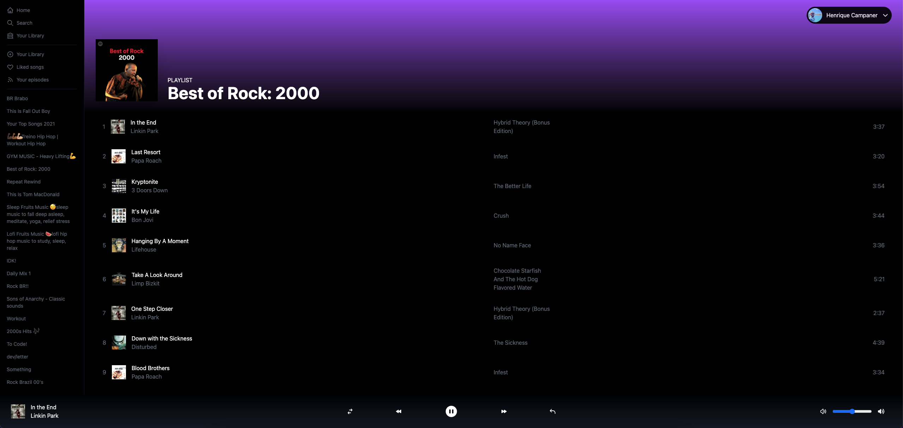

<div align="center">
  
  <h1>Spotify Clone</h1>
</div>

<p align="center">
  <a href="#-about-the-project">About the project</a> •
  <a href="#-technologies">Technologies</a> •
  <a href="#-getting-started">Getting started</a> •
  <a href="#-license">License</a>
</p>

<p align="center">
  
</p>

## 👩‍💻 About the project

[Spotify Clone]() is just a simple project to use the new functions of NextJs 12

## 🚀 Technologies

- [Next.js](https://nextjs.org/)
- [ReactJS](https://reactjs.org/)
- [TypeScript](https://www.typescriptlang.org/)
- [Next Auth](https://next-auth.js.org/)
- [Spotify Api](https://developer.spotify.com/documentation/web-api/)
- [Tailwindcss](https://tailwindcss.com/)

## 💻 Getting started

### Requirements

- [Node.js](https://nodejs.org/en/)
- [Yarn](https://classic.yarnpkg.com/) or [NPM](https://www.npmjs.com/) _(examples are with yarn)_

**Clone the project and access the folder**

```bash
$ git clone https://github.com/henriquecampaner/spotify-clone && cd spotify-clone
```

**Follow the steps below**

```bash
# Install the dependencies
$ yarn

# Make a copy of '.env.example' to '.env'
# and set with YOUR environment variables.
$ cp .env.example .env

# Start the app
$ yarn dev
```

## 📝 License

This project is licensed under the MIT License - see the [LICENSE](LICENSE) file for details.

---

.

<p align="center">
  Made with 💜&nbsp; by <a href="https://www.linkedin.com/in/henrique-campaner/">Henrique Campaner</a>
</p>
